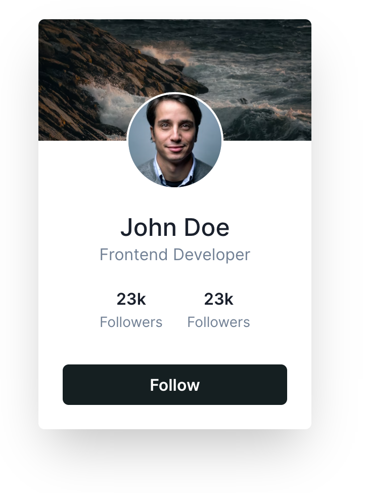

# React | Next.js | TypeScript | API | Styled

This is a [Next.js](https://nextjs.org/) project bootstrapped with [`create-next-app`](https://github.com/vercel/next.js/tree/canary/packages/create-next-app) and configured with:

1. **Linters:** ESLint, Prettier and Stylelint.
2. **Git helpers:** including Git hooks using Husky, Commitizen and Commitlint.
3. **NextJS and React specific folders:** `components`, `pages` and `views` (more on this later).
4. **Styled-Components:** configured Styled-Components with theme and types.

## Project structure

The app has the following structure:

- `components`: React components used accross the app.
- `pages`: NextJS specific pages. The pages should not contain any styles, and be limited to the page-specific logic.
  All the presentation and business logic should be implemented as a view.
- `views`: Contains the presentation elements for the pages. Can also include data and business logic.

## App Details

The app contains only one page, with a "Fetch" button. The goal is to display a profile card like the following when
the user presses the button:


### Fetch flow

When the user presses the button, we replace the button with the `LoadingPlaceholder` component while we perform the
fetch in the background. Then, replace it with the actual card.

### Tasks -> what i did.

1. Build a `ProfileCard` component similar to the one in the image. Use the same structure as in
   `LoadingPlaceholder`. It doesn't have to be identical to the image (since you don't have the specific measures),
   but it should be as close as possible.
2. Implement a custom hook in a `hooks` folder that encapsulates the fetching logic and holds the user profile values.

### Notes

1. You have a NextJS API route available that you can call to fetch all the details. This API route takes 2500ms to
   return the value to help visualize the placeholder component.
2. Use [Axios](https://github.com/axios/axios) as the request library.

### Make sure below things for this app.

1. _Structure of the code:_ both in terms of the actual code and the organization of files / folders.
2. _React patterns:_ how efficient and well-structure your React code is.
3. _TypeScript:_ how clear, helpful and explicit is your use of TypeScript.
4. _Documentation:_ how clear and well commented your code is.
5. _Git processes:_ how clear and well-structured your commits and commit messages are.

## Prerequisites

To set up the codebase and the required dependencies, simply run the following command.

```bash
# Set up tools:
$ ./run.sh setup
```

## Running the app

```bash
# development
$ npm run dev

# production
$ npm run build && npm run start
```

## Git processes

### Gitflow

This project follows the [Gitflow](https://www.atlassian.com/git/tutorials/comparing-workflows/gitflow-workflow) workflow.

### Commit

This repo is set up with [Commitizen](https://github.com/commitizen/cz-cli) to ensure proper commit messages. This is enforced by git hooks implemented with [Husky](https://github.com/typicode/husky). Use the terminal to do commits for this to work properly.
